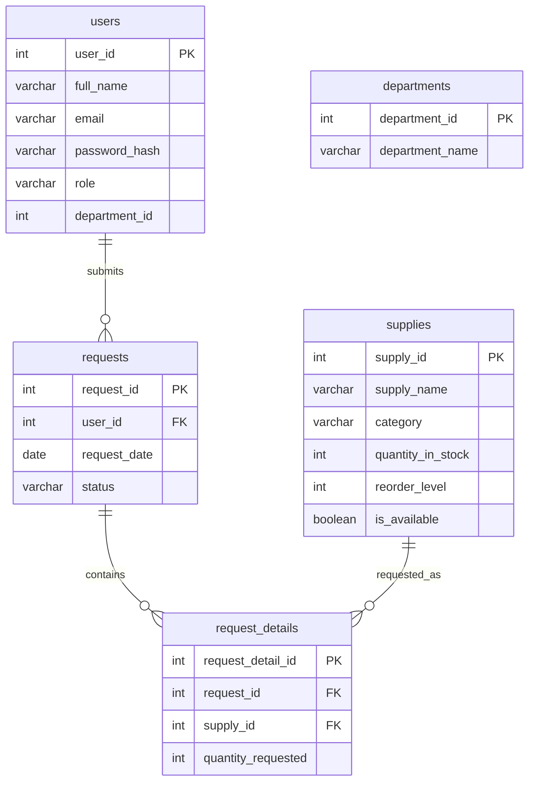

# OfficeSync Database Guide

This guide explains the MySQL database used by OfficeSync and how the Java code uses it.

## Database Name

```sql
officesync
```

The schema and sample data are in:

```text
database/officesync.sql
```

## Tables

### departments

Stores the company department used to group users. The current schema and seed data allow only `IT Department`.

| Column | Purpose |
| --- | --- |
| `department_id` | Primary key. |
| `department_name` | Unique department name. Must be `IT Department`. |

### users

Stores login accounts and role information.

| Column | Purpose |
| --- | --- |
| `user_id` | Primary key. |
| `full_name` | User display name. |
| `email` | Login email, unique. |
| `password_hash` | SHA-256 password hash. |
| `role` | `Admin`, `Head`, or `Employee`. Other roles are rejected by the database. |
| `department_id` | `0` for Admin, `1` for Head and Employee in `IT Department`. |

The Java `User.Role` enum must match the role names stored in this table.

### supplies

Stores inventory items.

| Column | Purpose |
| --- | --- |
| `supply_id` | Primary key. |
| `supply_name` | Supply/item name. |
| `category` | Group such as Paper, Writing, Filing. |
| `quantity_in_stock` | Current stock count. |
| `reorder_level` | Minimum desired stock level. |
| `is_available` | Whether the item is active/available for requests. |

The app treats a supply as `Low Stock` when:

```sql
is_available = TRUE AND quantity_in_stock <= reorder_level
```

The app treats a supply as `Out of Stock` when `is_available = FALSE` or `quantity_in_stock <= 0`.

### requests

Stores the request header: who requested, when, and current status.

| Column | Purpose |
| --- | --- |
| `request_id` | Primary key. |
| `user_id` | Foreign key to the requesting user. |
| `request_date` | Date the request was submitted. |
| `status` | `Pending`, `Approved`, or `Rejected`. |

### request_details

Stores the requested item and quantity for a request.

| Column | Purpose |
| --- | --- |
| `request_detail_id` | Primary key. |
| `request_id` | Foreign key to `requests`. |
| `supply_id` | Foreign key to `supplies`. |
| `quantity_requested` | Quantity requested by the user. |

The current app creates one detail row per request. The table design still allows future support for multiple supplies in one request.

## Relationships



## How Java Uses The Database

OfficeSync uses one compact database class:

```text
src/main/java/Database/OfficeSyncDatabase.java
```

This file contains the connection settings, connection helper, password hashing, and the login, supply, and request database methods. It keeps the project closer to the compact style of the Hospital Management System project while still keeping SQL separate from the Swing UI.

### Login Methods

`OfficeSyncDatabase.authenticate(email, password)` hashes the typed password with SHA-256 and compares it to `users.password_hash`. It left joins `users` with `departments` so Admin accounts with department ID `0` show `No Department`, while Head and Employee accounts show `IT Department`.

### Supply Methods

`OfficeSyncDatabase` handles inventory records with these methods:

- `findAllSupplies()` lists supplies.
- `findLowStockSupplies()` lists supplies where stock is less than or equal to reorder level.
- `findRequestableSupplies()` lists only supplies where `is_available = TRUE` and stock is greater than zero.
- `addSupply(...)` inserts a new supply.
- `updateSupply(...)` edits a supply.
- `deleteSupply(...)` deletes a supply.
- `countSupplies()` and `countLowStockSupplies()` feed dashboard/report cards.

### Request Methods

`OfficeSyncDatabase` handles supply requests with these methods:

- `findVisibleRequests(user)` lists requests based on the logged-in user's role.
- `submitRequest(...)` inserts into both `requests` and `request_details` inside one transaction. It rejects unavailable, out-of-stock, or over-stock request quantities.
- `updateRequestStatus(...)` changes request status to approved/rejected. Only Admin users can update request status. Approved and rejected requests are final and cannot be changed to the other final status. When a request is approved for the first time, the supply must be available and in stock, then the requested quantity is deducted from `supplies.quantity_in_stock` in the same transaction.
- `deleteRequest(...)` deletes detail rows first, then the request row, inside one transaction.
- `countPendingRequestsFor(user)` counts pending requests using the same role visibility rules.

## Role-Based Request Visibility

| Role | What They Can See |
| --- | --- |
| Admin | All requests. |
| Head | Requests from their own department. |
| Employee | Only their own requests. |

This logic is in `OfficeSyncDatabase.findVisibleRequests(...)`.

## Important Notes

- The SQL script drops and recreates tables, so running it resets the database.
- `request_details` depends on `requests` and `supplies`.
- `requests` depends on `users`.
- Because of these foreign keys, delete child records before parent records.
